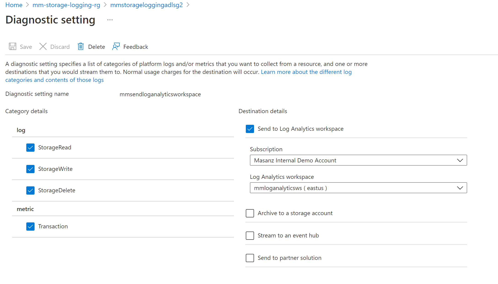
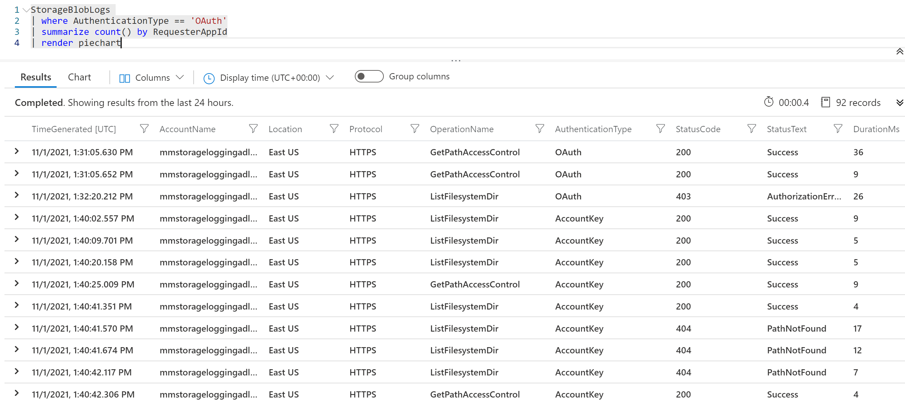
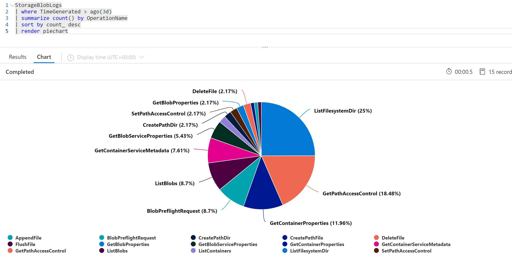

Azure Data Lake Gen2 Logging Capabilities
=========================================

Setting Diagnostic Settings to log into Log Analytics Workspace:

StorageBlobLogs

\| where AuthenticationType == 'OAuth'

\| summarize count() by RequesterAppId

\| render piechart

StorageBlobLogs

\| where TimeGenerated \> ago(3d)

\| summarize count() by OperationName

\| sort by count\_ desc

\| render piechart

StorageBlobLogs

\| where TimeGenerated \> ago(3d)

\| top 10 by DurationMs desc

\| project TimeGenerated, OperationName, DurationMs, ServerLatencyMs,
ClientLatencyMs = DurationMs – ServerLatencyMs

StorageBlobLogs

\| where TimeGenerated \> ago(3d) and StatusText !contains "Success"

\| summarize count() by OperationName

\| top 10 by count\_ desc
